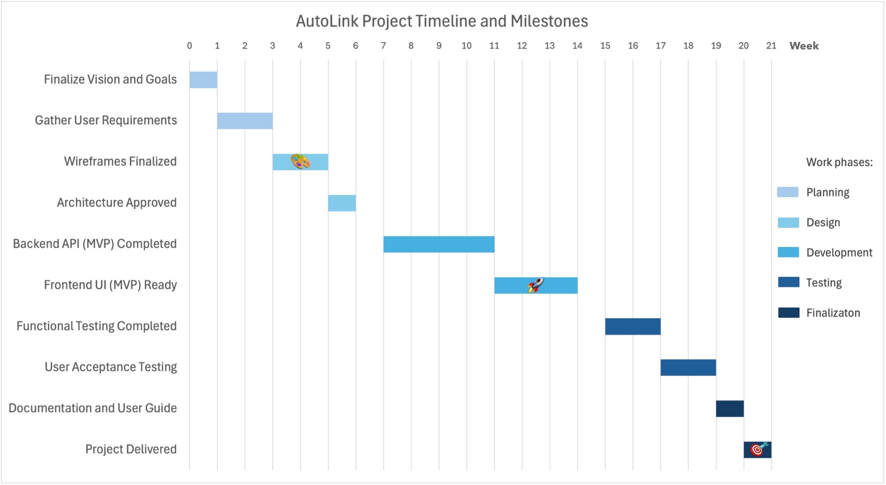

# Project Timeline and Schedule (Gantt Chart)

## Gantt Chart

---

## 1. Milestones Explanation

### 🎨 **Week 4 - Wireframes Finalized**
- **Description:** Completion of wireframes for the key screens, ensuring the user interface flows logically and aligns with the project's vision.
- **Estimated Time:** 1 week (spanning Week 3–4).
- **Dependencies:** Relies on gathering user requirements to inform the design.

### 🚀 **Week 13 - MVP Ready**
- **Description:** The Minimum Viable Product (MVP), including both backend API and frontend UI, is functional and integrated.
- **Estimated Time:** Backend API development (Weeks 6–10) and frontend UI development (Weeks 8–13).
- **Dependencies:** Depends on finalized wireframes and approved architecture.

### 🎯 **Week 20 - Final Delivery**
- **Description:** Delivery of the completed product, including testing, user documentation, and a user guide.
- **Estimated Time:** 2 weeks for finalization and delivery (Weeks 19–20).
- **Dependencies:** Requires functional and user acceptance testing to be successfully completed.

---

## 2. Team Composition

The team is structured as follows:

- **Project Manager:** Oversees planning, timeline management, and communication among team members to ensure milestones are met.
- **UX/UI Designer:** Designs wireframes and ensures the user interface is intuitive and visually appealing.
- **Backend Developer:** Builds the backend APIs, ensuring secure data flow and robust infrastructure.
- **Frontend Developer:** Implements the user interface, connecting backend functionality to create a seamless user experience.
- **Quality Assurance Specialist:** Conducts functional and user acceptance testing to verify the product meets all requirements.
- **Technical Writer:** Prepares user documentation and a guide to ensure the product is easy to adopt and understand.
